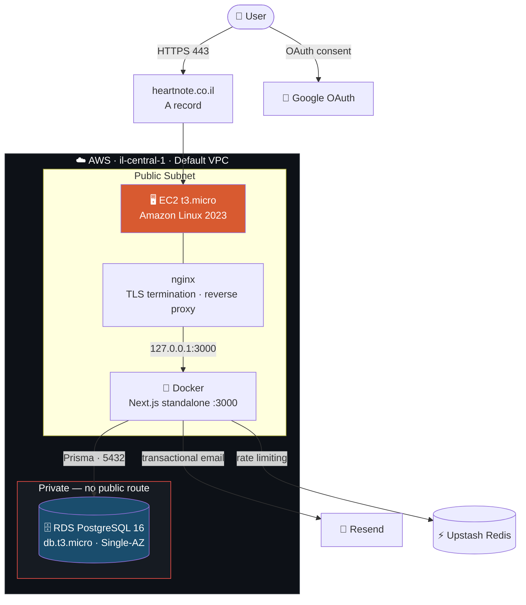
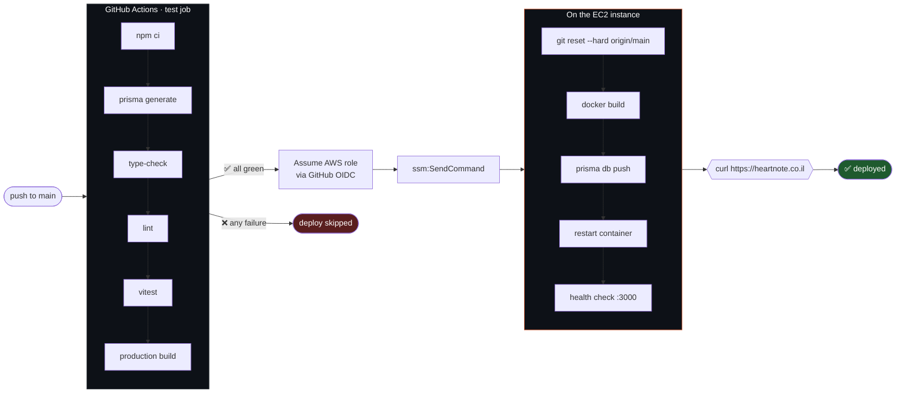

# ❤️ HeartNote

**HeartNote** is a Hebrew-first digital greeting card platform. Users pick an animated, interactive template, personalize it, and share it as a unique link — no app install, no recipient account.

🌐 **Live:** [heartnote.co.il](https://heartnote.co.il)

> _יצירת ברכות דיגיטליות מעוצבות – בעברית, לכל אירוע._

---

## Table of Contents

- [Overview](#overview)
- [Architecture](#architecture)
- [Tech Stack](#tech-stack)
- [CI/CD Pipeline](#cicd-pipeline)
- [Infrastructure](#infrastructure)
- [Security](#security)
- [Data Model](#data-model)
- [Business Logic](#business-logic)
- [Project Structure](#project-structure)
- [Local Development](#local-development)
- [Deployment & Operations](#deployment--operations)
- [Migration History](#migration-history)

---

## Overview

| | |
| --- | --- |
| 🎨 **Interactive templates** | 20 animated card types — scratch cards, decision wheels, love coupons, holiday scenes, quizzes, timelines |
| ✏️ **Live editor** | Real-time preview while customizing text, colors, and images |
| 🔗 **Shareable links** | Every card gets a public URL with a verification code |
| 🔐 **Dual auth** | Email/password (bcrypt) and Google OAuth, both through Auth.js v5 |
| 💎 **Tiered plans** | Free tier with quotas; paid tiers remove branding and unlock premium templates |
| 🌐 **RTL-first** | Built right-to-left for Hebrew, with Hebrew-optimized typography |
| 🌙 **Dark mode** | System-aware and manually toggleable |
| ♿ **Accessible** | Focus trapping, keyboard navigation, ARIA labels |

---

## Architecture

Self-hosted on AWS, provisioned entirely through Terraform. The database is never exposed to the internet — it is reachable only from the app server's security group.



### Network boundaries

| Port | Exposure | Purpose |
| --- | --- | --- |
| `443` | `0.0.0.0/0` | HTTPS — the only way in for users |
| `80` | `0.0.0.0/0` | Redirects to 443; serves ACME challenges |
| `22` | Single admin IP `/32` | SSH — never open to the world, **not** used by CI |
| `3000` | `127.0.0.1` only | App container, unreachable from outside the box |
| `5432` | App security group only | RDS — no public accessibility, no internet route |

### Request lifecycle

1. DNS resolves `heartnote.co.il` to the EC2 public IP.
2. nginx terminates TLS (Let's Encrypt, auto-renewing) and reverse-proxies to `127.0.0.1:3000`.
3. Next.js handles the request — a Server Component, Server Action, or Auth.js route.
4. Server Actions run `validateOrigin()` (CSRF) and `protectedAction()` (auth) before any business logic.
5. Prisma queries RDS over the private security-group path.
6. The response returns as streamed RSC payload or JSON.

---

## Tech Stack

| Layer | Technology |
| --- | --- |
| **Framework** | Next.js 14.2 (App Router, React Server Components) |
| **Language** | TypeScript 5.3 — strict mode, zero `any` |
| **UI** | React 18, Tailwind CSS 3.4, Framer Motion 11 |
| **Auth** | Auth.js (NextAuth) v5 — Credentials + Google OAuth, JWT sessions |
| **ORM** | Prisma 6.19 |
| **Database** | PostgreSQL 16 on AWS RDS |
| **Validation** | Zod 4 — every input, plus dynamic template schemas |
| **Server state** | TanStack Query 5 |
| **Email** | Resend |
| **Rate limiting** | Upstash Redis |
| **Testing** | Vitest + Testing Library |
| **Container** | Docker, multi-stage build → Next.js standalone |
| **IaC** | Terraform (AWS provider ~> 5.0) |
| **CI/CD** | GitHub Actions → AWS SSM |
| **Hosting** | AWS EC2 + RDS, nginx, Let's Encrypt |

---

## CI/CD Pipeline

Every push to `main` runs the full quality gate; only if it passes green does the deploy job run.



### Why SSM instead of SSH

GitHub-hosted runners get IPs from a large, rotating published range. Letting CI SSH in would mean opening port 22 to that entire range — a permanent, internet-facing attack surface for the sake of a deploy.

Instead the instance runs the SSM agent, which holds an **outbound** connection to AWS. CI calls `ssm:SendCommand`; the agent picks the command up and runs it locally. **No inbound port is opened at all**, and port 22 stays locked to a single admin IP.

### Why OIDC instead of access keys

CI stores no long-lived AWS credentials. GitHub mints a short-lived OIDC token per run, and AWS exchanges it for temporary credentials. The trust policy is pinned to this repository's `main` branch, so a fork or a pull-request branch cannot assume the role. The role itself can only send one command to one instance — it cannot create, stop, or reconfigure infrastructure.

### Secrets to configure

Under **Settings → Secrets and variables → Actions**:

| Secret | Source |
| --- | --- |
| `AWS_DEPLOY_ROLE_ARN` | `terraform output github_deploy_role_arn` |
| `EC2_INSTANCE_ID` | `terraform output ec2_instance_id` |

Optional repository **variable**: `AWS_REGION` (defaults to `il-central-1`).

Application secrets — database password, `AUTH_SECRET`, OAuth credentials, API keys — live **only** in `/opt/heartnote/client/.env` on the instance. They are never uploaded to GitHub and never touched by the deploy script.

---

## Infrastructure

All AWS resources are declared in [`infra/aws/`](infra/aws/):

| File | Contents |
| --- | --- |
| `main.tf` | EC2, RDS, security groups, subnet group |
| `iam.tf` | SSM instance role, GitHub OIDC provider, scoped deploy role |
| `variables.tf` | Inputs — region, instance sizes, domain, secrets |
| `outputs.tf` | Public IP, RDS endpoint, CI secret values |
| `templates/user_data.sh.tpl` | First-boot bootstrap: Docker, nginx, certbot, app |
| `deploy.sh` | Deploy script executed on the instance by CI |
| `destroy.sh` | Guarded teardown of all billed resources |

### Provisioning from scratch

```bash
cd infra/aws

# Secrets via environment, never committed to a file
export TF_VAR_db_password='...'
export TF_VAR_auth_secret="$(openssl rand -base64 32)"
export TF_VAR_auth_google_secret='...'
export TF_VAR_resend_key='...'

terraform init
terraform plan     # always review before applying
terraform apply
```

`terraform.tfvars` (gitignored) supplies the non-secret inputs:

```hcl
ssh_key_name     = "heartnote"
ssh_allowed_cidr = "YOUR.IP.HERE/32"   # never 0.0.0.0/0
site_domain      = "heartnote.co.il"
auth_google_id   = "..."
mail_heart_note  = "..."
```

On first boot `user_data` installs Docker, nginx and certbot, clones the repo, writes `.env`, applies the Prisma schema, builds the image, and starts the container behind the reverse proxy.

> **Note:** the EC2 resource declares `lifecycle { ignore_changes = [user_data] }`. Bootstrap only runs once; every deploy afterwards goes through CI. Without this guard, editing the template would replace a live instance — dropping its `.env`, its TLS certificates, and (with no Elastic IP) its public IP.

### Cost

Within AWS Free Tier this runs at **$0/month**. Outside it, roughly **$25–28/month**: EC2 `t3.micro` ~$7–8, RDS `db.t3.micro` ~$12–13, plus ~$5 of gp3 storage. A NAT gateway and Multi-AZ were deliberately avoided — neither is Free Tier eligible, and neither is needed for a single-instance deployment.

---

## Security

| Control | Implementation |
| --- | --- |
| **CSRF** | `validateOrigin()` checks `Origin` against an allowlist on every mutating Server Action |
| **Auth guard** | `protectedAction()` wraps authenticated actions; unauthenticated calls short-circuit with 401 |
| **Password storage** | bcrypt hashes — never reversible, never logged |
| **Account enumeration** | Banned, unknown, unverified, and wrong-password logins all fail identically |
| **Rate limiting** | Upstash Redis per IP — login 5/15min, registration 3/hr, password reset 3/15min |
| **PII in logs** | `logger.*` masks emails, UUIDs, and IPs in production; `console.*` is banned |
| **Security headers** | CSP, HSTS, X-Frame-Options, X-Content-Type-Options, Referrer-Policy, Permissions-Policy |
| **Transport** | TLS via Let's Encrypt, HTTP→HTTPS redirect, auto-renewal |
| **Database exposure** | No public accessibility; reachable only from the app security group |
| **Secret handling** | Env-only; `.env`, `*.tfvars`, and `*.pem` are gitignored |
| **CI credentials** | Short-lived OIDC tokens, branch-scoped, least-privilege |
| **Server Action limits** | 1 MB request body cap |

---

## Data Model

PostgreSQL 16, schema managed by Prisma ([`client/prisma/schema.prisma`](client/prisma/schema.prisma)):

| Table | Purpose |
| --- | --- |
| `users` | Auth identity — email, bcrypt hash, verification timestamp |
| `accounts` | Linked OAuth providers (Google) |
| `verification_tokens` | Hashed email-verification and password-reset tokens |
| `profiles` | Application user data — name, DOB, avatar, tier, quota counters |
| `templates` | Template metadata, JSON config schema, expiration policy |
| `creations` | User-generated cards — metadata JSON, expiry, verification code |
| `subscription_policies` | Per-tier creation limits and expiry windows |
| `banned_users` | Self-deletion blocklist |
| `password_reset_attempts` | Reset throttling audit trail |
| `audit_logs` | Security event log |
| `drafts` | Guest drafts saved before OAuth sign-in |

---

## Business Logic

### Subscription tiers

| Tier | Creations | Expiry | Branding | Premium templates |
| --- | --- | --- | --- | --- |
| `free` | 5 | Never | Yes | No |
| `lite` | 2 | 30 days | No | Yes |
| `premium` | 6 | 45 days | No | Yes |

### Creation flow

1. User selects a template; the editor renders fields from `config_schema`.
2. Submit calls the `createCreation()` Server Action.
3. Fast-fail guards run in order: premium expiry auto-downgrade → premium access check (402) → quota check (403).
4. `expires_at` is computed from the tier's policy.
5. The row is inserted and the quota counter decremented in a single transaction.

### Error contract

Every Server Action returns a discriminated union — raw errors never reach the client:

```typescript
type ActionResult<T> =
  | { success: true; data: T }
  | { success: false; error: string; code: number };
```

| Code | Meaning |
| --- | --- |
| 400 | Zod validation failed |
| 401 | Not authenticated |
| 402 | Premium template requires an upgrade |
| 403 | Quota exceeded, banned user, or CSRF origin rejected |
| 404 | Not found or soft-deleted |
| 409 | Duplicate (e.g. email already registered) |
| 429 | Rate limited |
| 500 | Unexpected server error |

---

## Project Structure

```
HeartNote/
├── .github/workflows/ci.yml         # Test + deploy pipeline
├── client/                          # Next.js application
│   ├── Dockerfile                   # Multi-stage → standalone runtime
│   ├── prisma/schema.prisma         # Database schema (source of truth)
│   └── src/
│       ├── app/                     # App Router
│       │   ├── (main)/              # Gallery, editor, profile, pricing
│       │   ├── (public)/            # Shared card links, demo
│       │   ├── api/auth/            # Auth.js route handlers
│       │   └── auth/                # Verification & callback routes
│       ├── actions/                 # Server Actions
│       │   ├── creations/           # Create, submit, redeem, delete
│       │   ├── profile/             # Read & update
│       │   └── subscription/        # Tier upgrades & policies
│       ├── components/
│       │   ├── templates/           # 20 interactive card renderers
│       │   ├── editor/              # Template editor
│       │   └── ui/                  # Shared primitives
│       ├── hooks/                   # TanStack Query hooks
│       ├── lib/
│       │   ├── auth/                # Auth.js config, credentials, onboarding
│       │   ├── utils/csrf.ts        # Origin validation
│       │   ├── utils/logger.ts      # PII-safe logging
│       │   ├── validations/         # Zod schemas
│       │   ├── protectedAction.ts   # Auth wrapper
│       │   └── prisma.ts            # Singleton client
│       └── middleware.ts            # Profile-completeness routing
├── infra/aws/                       # Terraform + deploy tooling
├── db/schema.sql                    # Raw SQL reference
└── docker-compose.yml               # Local PostgreSQL
```

**Conventions:** 150-line file limit, path alias `@/* → src/*`, Server Components by default, RTL-aware Tailwind (`ps-`/`pe-` over `pl-`/`pr-`), soft deletes.

---

## Local Development

### Prerequisites

- Node.js 20+
- Docker (for local PostgreSQL)

### Setup

```bash
git clone https://github.com/ilayadmoni/HeartNote.git
cd HeartNote

# Start local PostgreSQL
docker compose up -d db

cd client
npm install
cp .env.example .env        # fill in your values
npx prisma db push          # apply schema to the local database
npm run dev                 # http://localhost:3000
```

### Environment variables

| Variable | Description |
| --- | --- |
| `DATABASE_URL` | PostgreSQL connection string |
| `AUTH_SECRET` | JWT signing secret — `openssl rand -base64 32` |
| `AUTH_GOOGLE_ID` / `AUTH_GOOGLE_SECRET` | Google OAuth credentials |
| `RESEND_KEY` | Resend API key |
| `MAIL_HEART_NOTE` | Sender address for transactional mail |
| `NEXT_PUBLIC_SITE_URL` | Canonical site URL |
| `AUTH_URL` | Public origin for OAuth callbacks (production) |
| `AUTH_TRUST_HOST` | `true` when running behind a reverse proxy |
| `ALLOWED_ORIGINS` | Extra CSRF-allowed origins, comma-separated |
| `NEXT_PUBLIC_GTM_ID` | Google Tag Manager ID (optional) |

For Google OAuth locally, register the redirect URI `http://localhost:3000/api/auth/callback/google`.

### Commands

```bash
npm run dev          # Dev server
npm run dev:lan      # Bind 0.0.0.0 for mobile testing
npm run build        # Production build
npm run type-check   # tsc --noEmit
npm run lint         # ESLint
npx vitest           # Tests (watch mode)
npx vitest run       # Tests (single run)
```

---

## Deployment & Operations

Deployment is automatic: **merge to `main` → tests → deploy**. No manual step.

### Manual deploy (fallback)

```bash
ssh -i heartnote.pem ec2-user@<EC2_IP>
sudo bash /opt/heartnote/infra/aws/deploy.sh
```

### Diagnostics

```bash
sudo docker ps                        # container state
sudo docker logs heartnote --tail 50  # application logs
sudo tail -50 /var/log/nginx/error.log
sudo certbot certificates             # TLS expiry
```

### Certificates

certbot installs a systemd timer that renews automatically. One certificate covers both the apex and `www` hostnames.

### Teardown

```bash
cd infra/aws && ./destroy.sh   # destroys all billed resources
```

Recommended alongside it: a **Budget alert** in AWS Billing, which fires regardless of whether your machine is on.

---

## Migration History

The platform originally ran on **Supabase + Vercel** and was migrated to self-hosted AWS.

| Phase | Change |
| --- | --- |
| **Backend** | Supabase Auth → Auth.js v5; Supabase client → Prisma. RLS policies and database triggers were reimplemented as explicit application-layer guards (`protectedAction`, transactional quota checks), making authorization logic reviewable in code and testable in CI. |
| **Data** | Full `pg_dump` restored and transformed: `auth.users` → `users`, `auth.identities` → `accounts`, plus all application tables. bcrypt hashes carried over unchanged, so **no user had to reset a password**. |
| **Infrastructure** | Vercel → Terraform-provisioned EC2 + RDS, Dockerized, behind nginx with Let's Encrypt TLS. |
| **Delivery** | Vercel's built-in pipeline → GitHub Actions with OIDC and SSM-based deploys. |

Notable problems solved along the way:

- **Auth.js behind a proxy** — OAuth callback URLs resolved to the container's internal hostname and port, so Google rejected them with `redirect_uri_mismatch`. Root cause was an incompatibility between Auth.js v5 and Next.js 14.1; setting `AUTH_URL` on 14.1 crashed every auth route outright. Upgrading to Next.js 14.2 fixed both — and picked up a published security patch.
- **CSRF across hostnames** — requests from the `www` hostname were rejected 403 by origin validation, resolved with an explicit allowlist entry.
- **TLS name mismatch** — two separate certificates meant nginx served the wrong one for the apex domain; consolidated into a single multi-domain certificate.
- **Out-of-memory builds** — Next.js builds exhausted the `t3.micro`'s 1 GB of RAM; solved with swap plus an explicit Node heap ceiling.

---

## License

MIT
